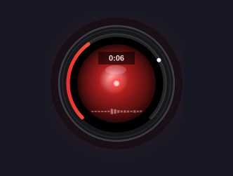

# voxtype-hal — HAL 9000 eye for Voxtype dictation

Replaces the default waveform bar with a **HAL 9000-style red eye** while
dictating. Everything lives inside the eye — nothing floats over your
desktop:

- **Lens** brightens with your voice, hot core when you're loud
- **Arc ring** = live volume level, with a held-peak tick
- **Mini bars** = scrolling sound-wave history
- **Pill** = elapsed time while speaking, flips to amber `Transcribing…`
  while the model works



## Install

```bash
git clone https://github.com/cyprusad/voxtype-hal.git ~/.config/voxtype/osd/voxtype-hal-src
~/.config/voxtype/osd/voxtype-hal-src/install.sh
```

That backs up your `config.toml`, points the OSD at the eye, silences the
"recording stopped" popup (the eye shows state now), and restarts voxtype.
Re-running it is safe. Needs `voxtype` 1.0.x with the Quickshell OSD
backend (`qs` on PATH).

Or as an Omarchy plugin (auto-applies on shell start):

```bash
omarchy plugin add https://github.com/cyprusad/voxtype-hal.git --enable
```

## Use

Press your dictation hotkey and speak. Release, and the pill flips to
`Transcribing…` until the text lands. Click the `◉` dot in your bar for
hues, re-apply/revert buttons, and paths.

## Color

Classic HAL red by default. Change any time — no restart, applies live:

```bash
./lens.sh hal     # classic HAL red (default)
./lens.sh system  # follow the active Omarchy theme
./lens.sh amber|ice|violet|#RRGGBB
```

## Remove

```bash
./uninstall.sh
omarchy plugin remove io.github.cyprusad.vox-hal --yes
```

(The first line restores your exact old setup; the second drops the shell
plugin. No CLI? Do the second step in the Omarchy menu under
Setup → Plugins → Remove. Note: removing only the shell plugin leaves a
working eye behind — `uninstall.sh` is what reverts Voxtype, because
Omarchy offers no uninstall hook.)

## Where things live

- **Your original setup:** `~/.config/voxtype/config.toml.pre-hal-*`
  (full backup, kept forever). Manual reset:
  ```bash
  cp ~/.config/voxtype/config.toml.pre-hal-* ~/.config/voxtype/config.toml
  systemctl --user restart voxtype
  ```
- **Installed eye:** `~/.config/voxtype/osd/voxtype-hal/`
- **Hue choice:** `~/.config/voxtype/osd/voxtype-hal/assets/lens.json`

## Hack on it

- `Hal.qml` — the eye (QtQuick + Canvas; check with `qmllint Hal.qml`)
- `EyePanel.qml` / `BarWidget.qml` — bar dot + panel
- `Service.qml` — headless auto-apply on shell start
- `voxtype-osd.toml` — style package manifest
- `manifest.json` — Omarchy plugin manifest (`io.github.cyprusad.vox-hal`)

## License

MIT — see `LICENSE`.
